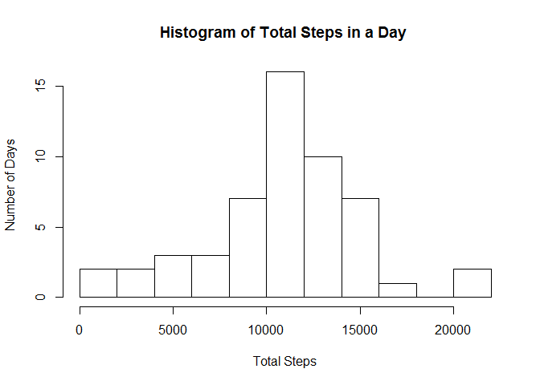
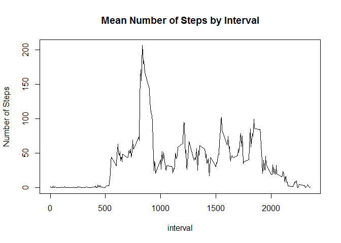
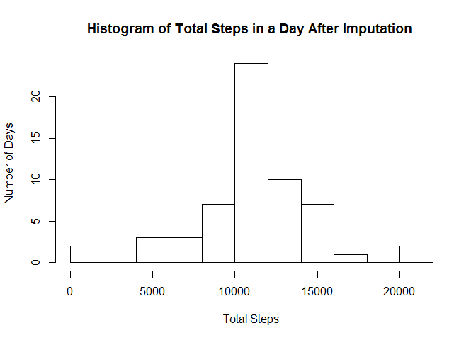
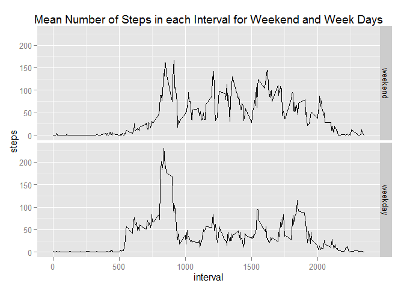

# Reproducible Research: Peer Assessment 1


## Loading and preprocessing the data
It is assumed that the data has been unzipped and the file activity.csv is in subdirectory activity in the working directory.

```r
activity <-read.csv("activity/activity.csv",header=T,stringsAsFactors=FALSE)
```
For the first parts, we ignore data containing NAs.

```r
activityComplete <- activity[complete.cases(activity),]
```
We load some libraries.

```r
library(reshape2,quietly=T)
library(lubridate,quietly=T)
```

```
## Warning: package 'lubridate' was built under R version 3.1.3
```

```r
library(ggplot2,quietly=T)
```

## What is mean total number of steps taken per day?
Sum the steps for each day, plot the histogram, show the mean and median.

```r
StepsByDate <- recast(activityComplete[c("date","steps")],formula=date~...,fun.aggregate=sum,id.var="date")
hist(StepsByDate$steps,breaks=10,main="Histogram of Total Steps in a Day ",xlab="Total Steps", ylab="Number of Days")
```

 

```r
print("Mean daily steps");print(mean(StepsByDate$steps))
```

```
## [1] "Mean daily steps"
```

```
## [1] 10766.19
```

```r
print("Median daily steps");print(median(StepsByDate$steps))
```

```
## [1] "Median daily steps"
```

```
## [1] 10765
```

## What is the average daily activity pattern?
Calculate the mean number of steps for each time interval.

```r
meanStepsByInterval <- recast(activityComplete[c("interval","steps")],formula=interval~...,fun.aggregate=mean,id.var="interval")
```
Plot the data and find the maximum.

```r
with(meanStepsByInterval,plot(interval,steps,type='l',main="Mean Number of Steps by Interval",ylab="Number of Steps"))
```

 

```r
print("The interval with highest mean steps");print(with(meanStepsByInterval,interval[which.max(steps)]))
```

```
## [1] "The interval with highest mean steps"
```

```
## [1] 835
```
## Imputing missing values
Calculate the number of incomplete rows in the original data.

```r
print("Number of incomplete rows");print(nrow(activity)-nrow(activityComplete))
```

```
## [1] "Number of incomplete rows"
```

```
## [1] 2304
```
Impute missing values, using the mean for each interval, rounded to be an integer.

```r
activityImputed <-activity

for (i in 1:length(activity$steps)) {
   if (is.na(activityImputed$steps[i])) {
      activityImputed$steps[i]<-round(meanStepsByInterval$steps[meanStepsByInterval$interval==activityImputed$interval[i]],0)
   }
}
```
Show mean, median and histogram for altered data.

```r
StepsByDate <- recast(activityImputed[c("date","steps")],formula=date~...,fun.aggregate=sum,id.var="date")
print("Mean daily steps after imputation");print(mean(StepsByDate$steps))
```

```
## [1] "Mean daily steps after imputation"
```

```
## [1] 10765.64
```

```r
print("Median daily steps after imputation");print(median(StepsByDate$steps))
```

```
## [1] "Median daily steps after imputation"
```

```
## [1] 10762
```

```r
hist(StepsByDate$steps,breaks=10,main="Histogram of Total Steps in a Day After Imputation ",xlab="Total Steps", ylab="Number of Days")
```

 

There is a slight change in mean due to rounding of imputed values.  
There is a slight change in median, due to insertion of new values.  
The histogram has 8 extra days in the modal class.

## Are there differences in activity patterns between weekdays and weekends?
Add a column identifying data as weekday or weekend.

```r
weekend <- weekdays(ymd(activityImputed$date),abbreviate=T) %in% c("Sat","Sun")
activityImputed$dayType <- factor(weekend,levels=c(TRUE,FALSE),labels=c("weekend","weekday"))
```
Calculate mean steps by interval and type of day.

```r
meanStepsByInterval <- recast(activityImputed[c("interval","steps","dayType")],formula=interval+dayType~...,fun.aggregate=mean,id.var=c("interval","dayType"))
```
Produce a faceted plot using ggplot.

```r
p <- ggplot(meanStepsByInterval,aes(x=interval,y=steps))+geom_line()+facet_grid(dayType~.)
p <- p + ggtitle("Mean Number of Steps in each Interval for Weekend and Week Days")
print(p)
```

 

